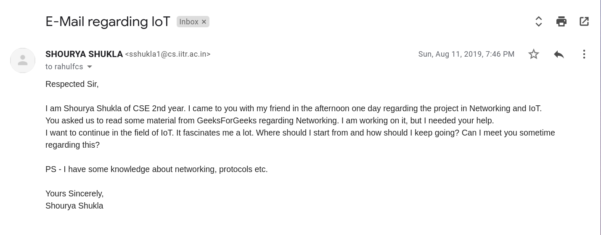

# Research Projects
Research projects are a special sort of projects which may last anywhere from 3 months to a whole year or beyond. They invlove researching on a particular topic/field either individually or under a professor or under an organisation. I will talk about those done under a professor or an organisation and how to go about them. Both of them involve similar procedures so a single writeup will do I guess.

## Benefits of Research Projects

They provide many benefits for instance:

	 - Deeper knowledge in a field
	 - More contacts you make through the party you're doing
	   the project under.
	 - Possibility of publishing a research paper in your UG;
	   something which is of immense value in the real world.
	 - Getting a good idea of how research is done; something
	   which will change your work habits and your outlook on
	   many things.

I will not talk about more because that is not the purpose of this guide.

## How to get one?

### Professors from your college

To start a research project you need to approach a professor. Mail them first that you want to take up a project under them. Do mention a little about your interests. Be polite please.
 

If I remember correctly, I asked a friend of mine to write the mail introducing us, so this isn't the first mail. Though, he backed out of the project after the first meeting so it is practically _my_ first introduction. I hate to use "_PS_" but I don't know why i used it above.

After a couple of meetings with the professor, you will be allotted a project to perform. You may be doing it alone or with a group (depends on the project).

It is important to note that such mails are generally very short as compared to the ones in the latter category because you generally know the professor here by face or by talking since they belong to your own institution.

### Professors from foreign universities

You may also approach professors from foreign universities for a project. You need to mail them the same way too but your mail will be a bit more verbose now. It will be divided into the following parts (paragraphs rather):

- **Your brief introduction**: Who you are, what you study, where you study. Try to keep this concise and not make it an autobiography.
- **Your interests**: Keep them relevant to the project. Do not cite interests like playing the Piano or reading books. Talk about the field. What you like, what projects you have done/doing, what you like about them. You may break this para into two for more readability.
- **What work of the professor have you gone through**: Cite a couple of his papers, maybe the recent ones or the ones accepted in great conferences (this does not guarantee that it was great work, but you have to write something so..). Writing what you loved about them would be great! Now not cite more than otherwise it may seem like you are lying. It is okay if you want to cite just one; in that case, do write something about why you liked it or just state something relevant to it.
- **Close the email now**: Write an ending remark, something like: "I have attached my resume for your perusal", "Looking forward to your reply", etc.

Please remember to attach your resume. Keeping the email crisp is key. A professor skims through your mail or rather his TA (Teaching Assistant) or RA (Research Assistant) reads the mail and decided if it is worth informing to the professor. Half of the things you wrote may not even be read, remember that.

_Though this mail is for a research internship, the same email with similar contents can be written for a research project._

The second paragraph could have been shorter and more concise. The overall language could have been better. I wrote this mail in February 2019, so I guess the timing was a bit bad, especially for a Professor in China. Note that such small things like timing also matter. If I were to write such a mail in today's times, it would be far better than this and more concise since now I am aware of how professors read a mail.

---
A thing worth mentioning here is that foreign projects may seem very lucrative because, "foreign". But this does not guarantee a good project or a good mentoring from the professor's side please keep this in mind. Doing a project from your own university enables you to physically meet the professor and discuss your problems and findings.

Both have their own pros and cons, there is nothing wrong with doing a project in your own college, and nothing glorifying in doing the same from abroad. The main takeaway is that how much knowledge you are able to gain. This may sound very cheeky but is very true in today's times when all people care about is bragging and showing off their hollow knowledge to others.

I hope this helps you in some way or the other!

